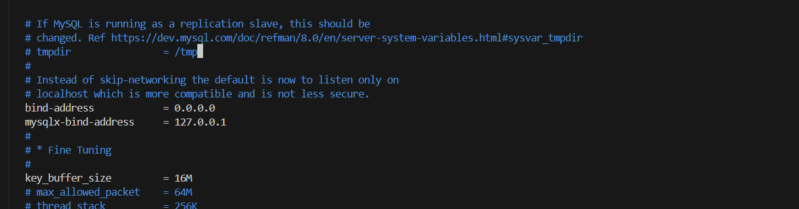
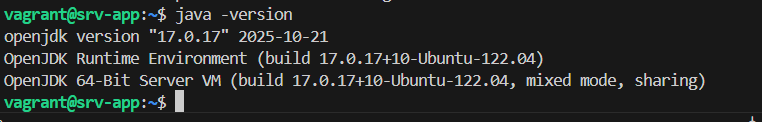
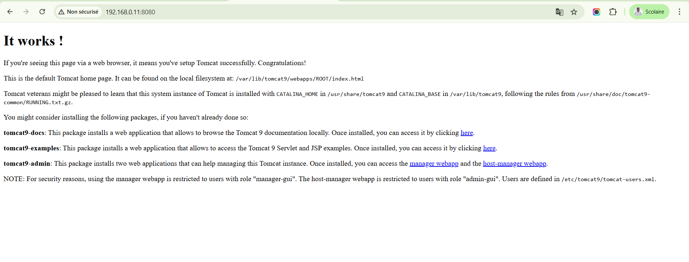

# TP2 - DevOps - Virtualisation - Linux

## Objectifs

Création de VM avec vagrant:
Creer 2 VM avec vagrant : srv-app et srv-db
Déploiement d'une application web :
Connecter vous via ssh sur srv-app
sur srv-app insatller jdk : 8, 11, 17 sur Ubuntu
Installer tomcat 9
Déployer y un une application web java qui utilise une base de données mysql
Déploiement d'une base de données :
Connecter vous via ssh sur srv-db
Installer y mysql
Créer votre base de données avec l'utilsateur utilisé dans votre application web java
Lancer les tests

## Prérequis

- Avoir installé vagrant et virtualbox

## Instructions

- Lancer la VM
  `vagrant up`
- Se connecter en ssh sur les VM
  `vagrant ssh srv-app`
  `vagrant ssh srv-db`

- POur la vm srv-db
  - Installer mysql
  - Créer la base de données et l'utilisateur

  `sudo apt install mysql-server -y`
  `sudo systemctl enable mysql`
  `sudo systemctl start mysql`
  - Se connecter à mysql
    `sudo mysql`
  - Créer la base de données et l'utilisateur

  ```sql
    CREATE DATABASE appdb;
    CREATE USER 'appuser'@'192.168.0.%' IDENTIFIED BY 'app123';
    GRANT ALL PRIVILEGES ON appdb.* TO 'appuser'@'192.168.0.%';
    FLUSH PRIVILEGES;
    EXIT;
  ```

  - Ajouter le fichier de configuration pour autoriser les connexions distantes
    `sudo vi /etc/mysql/mysql.conf.d/mysqld.cnf`
    - Trouver la ligne `bind-address = 127.0.0.1` et la remplacer par `bind-address = 0.0.0.0`
      
    - Sauvegarder et redémarrer le service mysql
      `sudo systemctl restart mysql`

- Pour la vm srv-app
- Installer jdk 8, 11, 17
  `sudo apt install openjdk-8-jdk openjdk-11-jdk openjdk-17-jdk -y`
- Verifier l'installation
  `ls /usr/lib/jvm`

  `sudo update-alternatives --config java`

  `java -version`
  

- Définir JAVA_HOME (exemple Java 17)
  `sudo vi /etc/environment`
  - Ajouter la ligne `JAVA_HOME="/usr/lib/jvm/java-17-openjdk-amd64"`
- Puis
- `source /etc/environment`

- Installer tomcat 9
  `sudo apt install tomcat9 tomcat9-admin -y`
- Démarrer tomcat
- `sudo systemctl start tomcat9`
- `sudo systemctl status tomcat9`

- Vérifier que tomcat fonctionne en allant sur `[http://192.168.0.11:8080](http://localhost:8080).
  
- Déployer l'application web
  - Copier le fichier war dans le répertoire webapps de tomcat
    `vagrant upload app/examen-0.0.1.war /home/vagrant/`

    ```bash
        sudo mv /home/vagrant/examen-0.0.1.war /var/lib/tomcat9/webapps/
        sudo chown tomcat:tomcat /var/lib/tomcat9/webapps/examen-0.0.1.war
    ```

  - Redémarrer tomcat
    `sudo systemctl restart tomcat9`

- Tester la connexion à la base de données via l'application web
  ```bash
    sudo apt install mysql-client -y
    mysql -h 192.168.0.12 -u appuser -p
  ```
